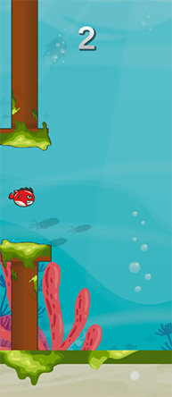

# Flappy Bird Clone - Unity Game

This is a Flappy Bird clone created using Unity game engine. The game is a simplified version of the classic Flappy Bird, where the player controls a fish and tries to navigate it through obstacles by tapping the screen.

## Play

- [Itch.io](https://gr4ndsmurf.itch.io/tappy-fish)

## Table of Contents

- [Game Overview](#game-overview)
- [Game Controls](#game-controls)
- [Features](#features)
- [How to Play](#how-to-play)
- [Script Explanations](#script-explanations)
- [Credits](#credits)

## Game Overview

In this Flappy Bird clone, you control a fish and try to keep it afloat by tapping the screen or clicking the mouse button. The game is designed to challenge your timing and reflexes, as you need to navigate the fish through gaps between columns while avoiding collisions with both the columns and the ground.

The game features a scoring system where you gain points by passing through gaps between columns. The game ends if the fish collides with any obstacle or the ground.

## Game Controls

- **Tap** or **Left-click**: Make the fish swim upwards.

## Features

- Simple and intuitive controls.
- Scoring system to track your progress.
- Colorful graphics and animations.
- Medals based on your score: Metal, Bronze, Silver, and Gold.
- Sound effects for swimming, hitting obstacles, and scoring points.
- Game Over screen with the option to restart the game.

## How to Play

1. Clone or download the repository.
2. Open the project in Unity.
3. Navigate to the "Scenes" folder and open the "Main" scene.
4. Press the Play button in Unity to run the game in the editor.
5. Tap the screen or click the mouse button to make the fish swim upwards.
6. Avoid collisions with columns and the ground.
7. Score points by passing through gaps between columns.
8. Try to achieve a high score and earn different medals.

## Script Explanations

### Fish.cs

This script is attached to the player-controlled fish GameObject and handles its movement, rotation, and collision interactions.

### GameManager.cs

This script manages the game state and UI elements like the game over panel and score display.

### ObstacleSpawner.cs

This script handles the spawning of obstacles in the game.

### Score.cs

This script manages the player's score and high score display.

### leftMovement.cs

This script controls the movement of ground and obstacle columns.
